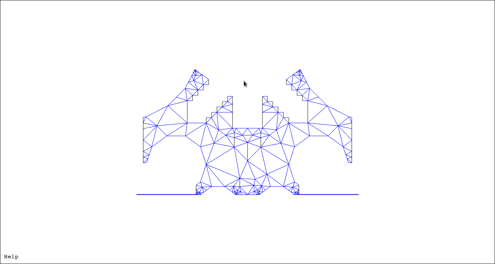
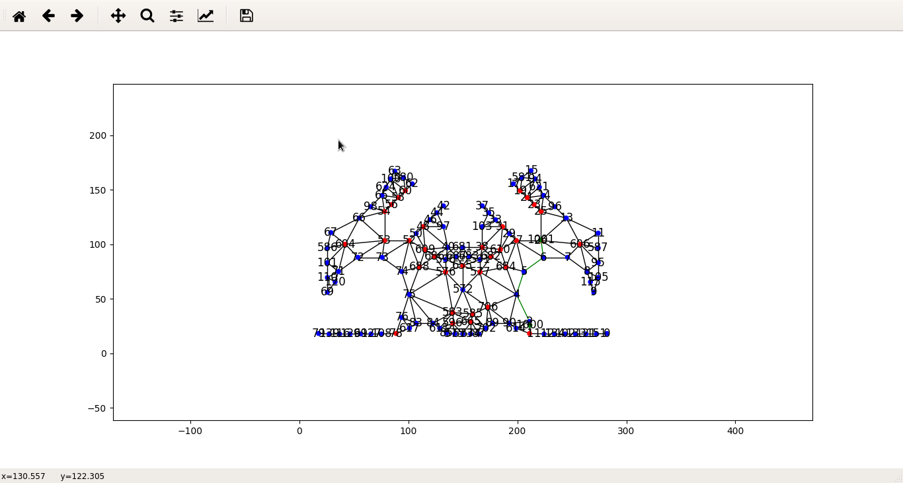

# PathFinding

## Solutions possibles

[Plusieurs solutions](http://theory.stanford.edu/%7Eamitp/GameProgramming/MapRepresentations.html#navigation-meshes)
sont possibles pour implémenter un pathfinding. Ayant une régulation seulement en position, le
*navigation mesh* m'a paru la solution la plus adapté à notre cas (moins couteux en mémoire/calcul
qu'une grille de cases).

## Navigation mesh

Le navigation mesh consiste en deux étapes:

- La création d'un mesh (suite d'arêtes et de sommets) représentant le terrain disponible pour le
  robot
- La convertion du mesh en un graphe pour appliquer l'algorithme de recherche (dijkstra, A\*, ...)

### Creation du mesh

Notre programme principal étant programmé en Python, nous devions trouver des librairies
compatibles. Plusieurs libraires ont été considérées:

- [PyMesh](https://pymesh.readthedocs.io/en/latest/)
    - Aucune API pour créer un mesh facilement
- [MeshPy](https://documen.tician.de/meshpy/)
    - Segfault lors de la création de mesh plus compliqués
- [The fenics projects tools](https://fenicsproject.org/)
    - Constitué de plusieurs outils pour la création de mesh
        - Dolfin permet de créer des meshes.
        - Mshr permet de créer facilement des meshs Dolfin.
    - *Pain in the ass* installation
    - Relativement bonne performance sur un ordinateur normal (5-10 min pour la création de meshs
      (parfois moins)(possibilité d'ajouter de la cache)) par contre inutilisable sur la raspberrypi
      (3h de création de mesh!).

Pour des raisons évidente, nous sommes partis sur la solution Dolfin+Mshr. Pour simplifier le
developpement, je conseille d'activer VTK par defaut pour visualiser le mesh créer. Une bonne source
pour les scripts de compilation sont les PKGBUILDs des AUR packages d'ArchLinux genre
[celui-ci](https://aur.archlinux.org/cgit/aur.git/tree/PKGBUILD?h=python-dolfin-git).

### Création du graphe

La librairie que nous avons utilisés pour gérer les graphes s'appelent
[*Networkx*](https://networkx.readthedocs.io/en/stable/). La librairie est codée en C++ avec un
wrapper python ce qui donne des performances incomparables par rapport à une solution native. Un
avantage également est l'intégration de [Matplotlib](http://matplotlib.org/) pour afficher les
graphes facilement mais également la suite de fonctions avancées sur la manipulation de graphe
(Dijkstra, ...).

Pour créer notre graphe, nous utilisons les positions de chaque sommet de notre mesh ainsi que les
connections entre chaque sommets pour avoir les arêtes. Ensuite, une simplification du graphe est
effectuée. Celui-ci est faite en mergeant les sommets les plus proches les 1 des autres. Cette
simplification permettra d'avoir moins de nodes en mémoire et limiter la puissance requise.

Ensuite, grâce à la fonction intégrée dans Networkx, on cherche le chemin. Finalement, on convertit
la liste de sommets en instructions comprehensible pour notre API moteurs.

## Mot final

Par manque de temps, nous n'avons pas eu le temps de finir le pathfinding. Le code n'est donc pas
fonctionnel ni terminé. L'approche prise pour le pathfinding n'est pas non plus optimum parce que le
robot aura tendance à longer les obstacles. Le problème également de cette approche est
l'inefficacité du chemin puisque le robot aura tendance à faire des petites distances puis tourner,
etc... Le temps étant très limité, cette approche meme fonctionnel n'aurait pas été viable pour le
concour Eurobot.

En résumé, pour implémenter un pathfinding correct, il faut absolument avoir une régulation en
vitesse correcte. Celle-ci permettra de palier au fait que le graphe est une suite de petites
distances et de tournants. Une autre solution est d'implémenter un *potential field*.

## Autres solutions

*Potential field* pourrait être très bon système de pathfinding si une régulation en vitesse était
implémenter. Celui-ci représente le terrain comme un potentiel où l'arrivée est le potentiel le
plus bas et le départ le potentiel le plus haut. On peut donc faire descendre le robot *par
gravité* vers le potentiel le plus bas. Les obstacles peuvent être représenté par un potentiel très
haut ce qui va repousser le robot vers les potentiels plus bas.
